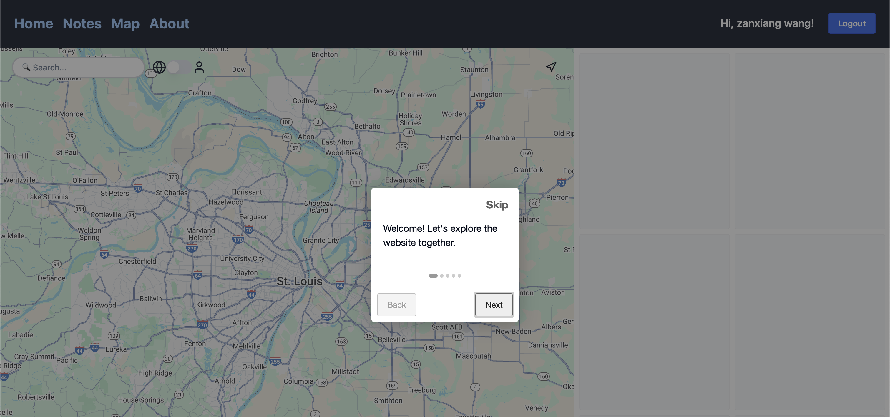
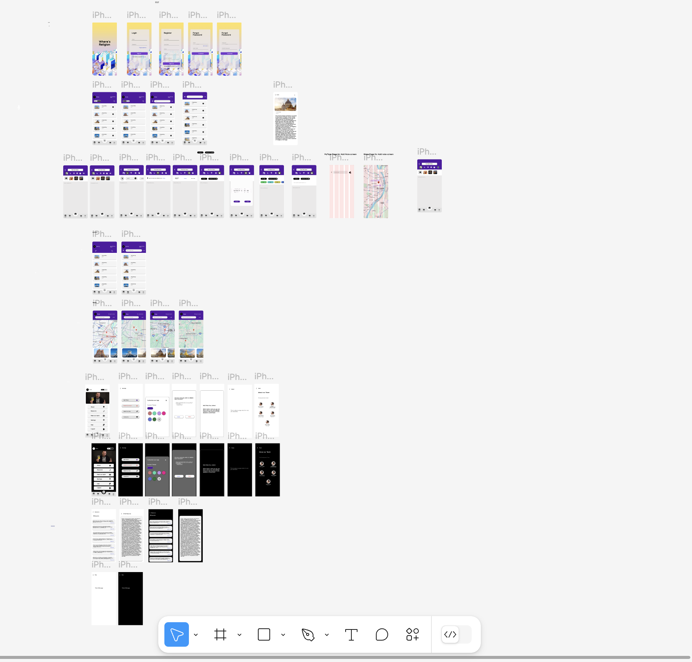
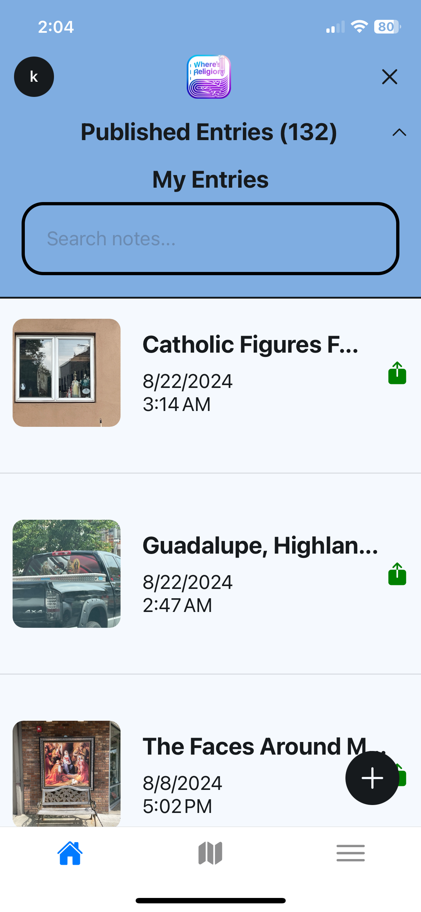
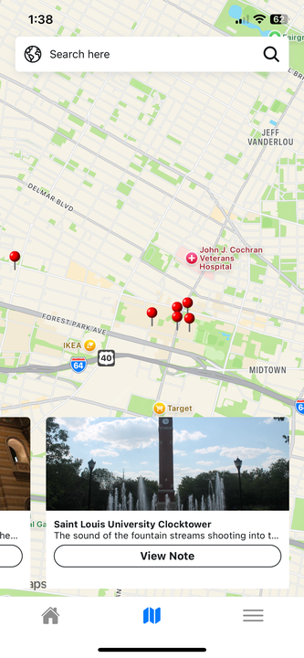
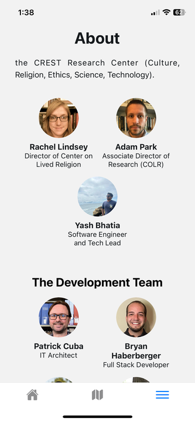
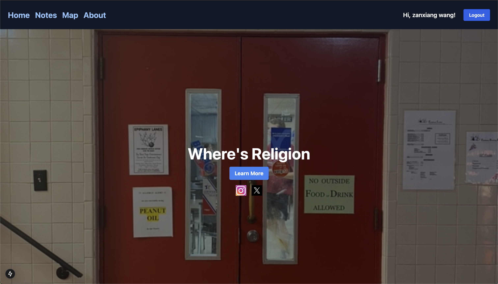
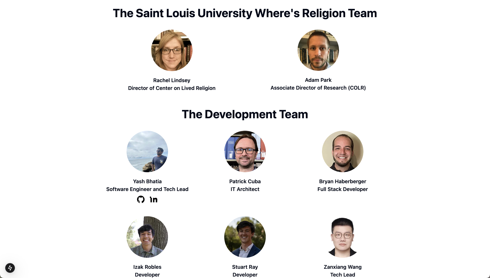

This semester, the *Where's Religion* Desktop and Mobile teams reached an incredible milestone by completing the Minimum Viable Product (MVP) and launching the app's domain live. From refining the user interface to addressing technical challenges, this journey was filled with collaboration and problem-solving.

<!--truncate-->

**What:** Completion of MVP and public launch of *Where's Religion*  
**Who:** The *Where's Religion* Desktop and Mobile development teams  
**When:** Fall Semester  
**Where:** Live across web and mobile platforms  
**Resources:** [Where's Religion Website](https://wheresreligion.org)

*Where's Religion* is a platform that allows users to document and share multimedia annotations of places where religion is encountered in everyday life. With features like interactive mapping, multimedia uploads, and a robust search system, the app bridges faith traditions, cultural insights, and human experiences.

---

### **Key Highlights of Website Development**

#### **UI and UX Enhancements**

We listened closely to user feedback and made significant updates to improve the app's design and functionality. After meeting with our client, we decided to make several changes to enhance usability and aesthetics. One of the most noticeable changes was updating the homepage and notes page backgrounds to a more vibrant color palette, giving the app a fresh and engaging look. Additionally, we modified the toolbar buttons to create a more uniform design, making them visually appealing and easier for users to navigate.

For onboarding, we implemented an interactive tour to help new users understand the platform. This task was also a great way to give our capstone team the opportunity to familiarize themselves with the project. We chose **Intro.js** as the library for this feature because of its popularity and ease of use. Later, we customized the CSS components of the onboarding tour to make it more visually pleasing and easy to follow, ensuring a smooth and welcoming user experience.

In response to feedback on the notes view, we made significant improvements to how users interact with media. We updated the media component so users can play video and audio files directly within the view, eliminating the need to click on links to access them. Additionally, based on our client's request, we consolidated all media upload functionalities into the editor menu control. This change streamlined the process, enabling users to upload and manage all their media files in one place.



#### **Evolving Media Uploads**

To meet user needs and improve functionality, we completely overhauled the media upload feature. Users can now upload multiple files at once, making the process faster and more efficient. Additionally, we enhanced the annotation tools to allow for tagging and organizing uploads with greater flexibility, helping users manage their content more effectively.


#### **Archiving Instead of Deleting**

While developing the app, we encountered an issue with database relationships that made data deletion problematic. Deleting records caused disconnections between related data, which compromised the app's functionality. To resolve this, we implemented an archiving system instead of outright deletion. This change preserved the integrity of database relationships and allowed users to restore archived data if needed, offering a robust and user-friendly solution.

#### **Fixing Memory Leaks in Test Cases**

Addressing memory leaks in our test cases was one of the most complex challenges we faced. Through a thorough review of previous test implementations, we identified several causes of memory leaks. Unclosed database connections were a significant issue, as were persistent global variables that prevented garbage collection. Circular references between objects and unremoved event listeners also contributed to memory retention. Additionally, timers (`setTimeout`, `setInterval`) that were not cleared after tests caused memory to remain allocated unnecessarily.

To fix these issues, we ensured all database connections were properly closed, event listeners were removed, and timers were cleared after tests. Circular references were refactored to avoid retention, and global variables were scoped appropriately. We used tools such as Jest's `--detectLeaks` flag to identify potential memory leaks and `--detectOpenHandles` to find unclosed resources. The `--logHeapUsage` flag helped us monitor memory usage across test suites, providing insights into patterns of memory growth and areas for optimization. These efforts resulted in more reliable and efficient test cases.

---

### **Impact and Reflections**

Launching the app domain has already had a noticeable impact. Users have embraced the platform's capabilities, and institutions are exploring how they can leverage the tools for their communities. This success is a testament to the hard work and dedication of our teams.

#### **Team Collaboration**

The Desktop and Mobile teams showcased exceptional collaboration throughout the semester. Both teams sat down with our client for live coding sessions, implementing changes in real time while receiving immediate feedback. This iterative process allowed us to refine the app’s features quickly and ensure they aligned with the client’s vision. Together, we also worked on creating Figma designs for the mobile app, collaborating closely with the client to compare the differences between mobile and desktop designs. A key focus during these discussions was how to effectively manage the app's real estate to include as many features as possible while ensuring usability across both platforms. By leveraging each team’s strengths, we resolved bugs and critical issues, enabling a smooth and timely product launch.

#### **Communication**

Effective communication between the Desktop and Mobile teams and with our client played a pivotal role in the project’s success. Regular meetings were held to discuss progress, share ideas, and address challenges collaboratively. These discussions enabled both teams to synchronize workflows, share updates on design decisions, and identify ways to integrate features across platforms seamlessly. Additionally, we presented our ideas for future app implementations to the client, incorporating their feedback to refine our roadmap. This transparent and dynamic communication process ensured that everyone involved was aligned with the project’s goals and priorities.

#### **Fostering Open Source Community**

In addition to launching the app, our team worked to foster a sense of community within the Open Source with SLU program. By involving the client in live feedback sessions and collaborative design discussions, we demonstrated the value of open-source principles—transparency, collaboration, and user-driven development. Sharing our design choices, such as how to adapt the app's features to mobile platforms while maintaining functionality, also highlighted our commitment to creating a tool that serves diverse user needs. This approach not only strengthened our relationship with the client but also showcased the collaborative potential of open-source development to the broader SLU community.

---

### **Lessons Learned**

Through this project, we learned the importance of prioritizing user feedback and iterating quickly to address it. Building for scalability from the start allowed us to reduce technical debt and create a more robust foundation for future growth. Additionally, embracing challenges as opportunities for learning and innovation enabled us to deliver a better, more user-friendly platform.

---

### **Looking Ahead**

While this semester’s achievements are monumental, we are just getting started. Our roadmap includes ambitious plans to enhance the platform further:

- We are exploring adding animations to the homepage to make it more dynamic and engaging for users.  
- A complete redesign of the user interface is in the works to make it more visually appealing and intuitive.  
- We plan to implement custom scripts that will automatically convert all uploaded media files to standardized formats: audio to MP3, video to MP4, and images to JPEG.  
- Modifications to how location information is displayed to users during the note creation process are planned to ensure clarity and ease of use.  
- A new design for the publishing toggle is in development to provide a more user-friendly and visually consistent experience.  
- Completing the About page is a top priority, as it is still in progress and will provide users with insights into our vision, mission, and team.

We’re proud of what we’ve built and excited to continue growing *Where’s Religion* into a tool that enriches the way people experience and document their encounters with religion.


## **Key Highlights of Mobile Development**

---

### **Seamless Navigation and State Management**

Smooth navigation was a major priority for the **Where's Religion Mobile** app. **Redux state management** was introduced to create a seamless, user-friendly navigation experience. The system enables real-time updates to the app's navigation state, reducing manual updates and improving responsiveness.

**Key Features of Navigation:**
- **State Tracking**: Tracks user states like **"loading," "onboarding," "login," and "home"** to ensure smooth user transitions.  
- **Real-time Navigation Updates**: Navigation updates instantly as users complete actions like onboarding or logging in.  
- **Consistent User Flow**: Smooth state transitions allow users to move seamlessly from onboarding to login and into the main app experience.  

Here’s an example of the navigation system using Redux:  

```typescript
import { createSlice, PayloadAction } from '@reduxjs/toolkit';

interface NavigationState {
  navState: 'loading' | 'onboarding' | 'login' | 'home';
}

const initialState: NavigationState = {
  navState: 'loading', // Default state
};

const navigationSlice = createSlice({
  name: 'navigation',
  initialState,
  reducers: {
    setNavState(state, action: PayloadAction<'loading' | 'onboarding' | 'login' | 'home'>) {
      state.navState = action.payload;
    },
  },
});

export const { setNavState } = navigationSlice.actions;

export default navigationSlice.reducer;
```

The implementation of Redux improved navigation performance and provided users with a fluid experience for onboarding, login, and other key app transitions.

---

### **Design and Figma to Mobile Development**

The **Where's Religion Mobile** app underwent a significant design transformation this semester. The process began with **Figma mockups**, which served as blueprints for the development of responsive and user-friendly screens.

**Key Features of Design and Development:**
- **Responsive Mobile Screens**: Over 40% of the designs were converted into fully functional, responsive screens using React Native.  
- **Design Consistency**: Maintained design fidelity, ensuring the mobile version stayed true to the Figma prototypes.  
- **Visual Enhancements**: Elements like navigation menus, onboarding screens, and login pages were refined for clarity and ease of use.  

Here are some of the key designs from Figma that were converted into mobile screens:  

  
  

This design process ensured a consistent user experience across devices and maintained alignment with the app's desktop version.

---

### **UI and Styling Enhancements**

To create a modern, visually appealing, and consistent app, significant efforts were made to improve **UI and styling**. The development team focused on enhancing visual clarity, aligning interface components, and improving the overall user experience.

**Key Enhancements:**
- **Search Bar and Dropdown Menu Alignment**: The search bar and dropdown menu were adjusted for better alignment to avoid overlapping UI elements.  
- **Login and Sign-Up Page Enhancements**: The **"Forgot Password"** link was repositioned, and the call-to-action for new users was updated to **“Don’t have an account? Register.”**  

These enhancements made the app more user-friendly, improved visual clarity, and aligned the app’s design with modern user experience principles.  

  

---

#### **Mobile vs. Desktop Design Comparison**

| **Mobile Map View**                                           | **Desktop Map View**                                            |
|---------------------------------------------------------------|-----------------------------------------------------------------|
|  |  |

| **Mobile List View**                                          | **Desktop Map View**                                            |
|---------------------------------------------------------------|-----------------------------------------------------------------|
|  |  |

| **Mobile About View**                                         | **Desktop About Views**                                         |
|---------------------------------------------------------------|-----------------------------------------------------------------|
|  |   |

---

## **Impact and Reflections**

The launch of the **Where's Religion Mobile MVP** has had a profound impact, providing users with an intuitive platform for documenting religion in everyday spaces. The following features have made the app more engaging and user-friendly:

### **User-Centric Impact**
- **Seamless Navigation**: The introduction of **Redux state management** ensures a smooth, dynamic navigation experience for users.  
- **Media Upload and Playback**: Users can now interact with media directly within the app, enabling a more immersive experience.  
- **Cross-Platform Consistency**: The mobile and desktop versions of the app maintain a consistent user experience, ensuring familiarity for users on either platform.  

The launch of the mobile platform has increased user engagement and allowed institutions to leverage the platform's capabilities for documenting religious encounters in the field.

---

## **Looking Ahead**

With the MVP live, development for **Where's Religion Mobile** is ongoing. The next phase of development will focus on further enhancing performance, accessibility, and user experience.

### **Planned Enhancements**
- **Improved Error Messaging**: Enhancing login and registration error messages to provide users with clear and actionable feedback. This change will ensure a smoother onboarding experience and build user trust.  
- **Pin Clustering on Maps**: Refining the pin clustering functionality to reduce clutter and provide better visual clarity. This update will improve navigation and usability for users exploring large maps with multiple points of interest.  
- **Consistent UI Across Android and iOS**: Resolving UI inconsistencies between Android and iOS to offer a uniform experience across platforms. This enhancement will ensure visual consistency, improving the app's professionalism and user experience.  
- **Lottie Animations for Loading and Error Screens**: Adding engaging animations to improve the app's visual appeal during loading and error scenarios. This update will create a more polished and dynamic experience for users.  
- **"About Us" Page Update**: Enhancing the "About Us" page to present a polished, professional face for the app’s public launch. This update is essential for creating a strong first impression with users and stakeholders.  

These updates aim to make **Where's Religion Mobile** a more powerful, polished, and user-friendly tool for capturing and sharing religious encounters. By addressing critical issues like navigation, UI consistency, and user feedback, the app will continue to improve usability and engagement.


