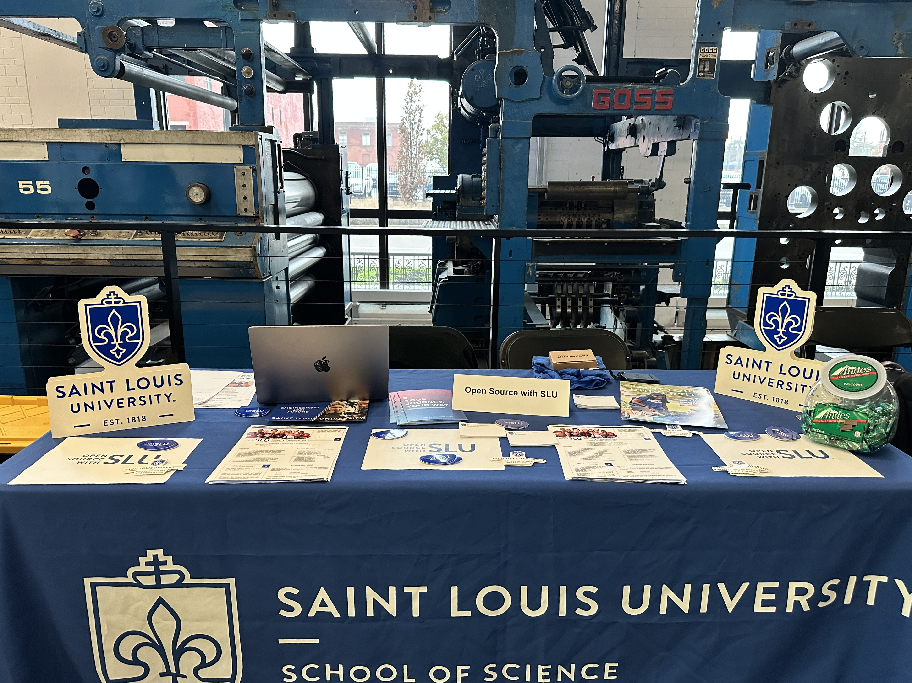

<!--truncate-->

The **Saint Louis Startup Connection** event ([official website](https://www.stlouisstartupweek.com)) continues to be a cornerstone of the region’s entrepreneurial ecosystem, where founders, investors, and innovators converge to share ideas and spark collaborations. This year,  **Open Source SLU** (OSS-SLU)—our experiential software engineering program at Saint Louis University—joined the lineup to showcase how we contribute to the growth and success of early-stage ventures.

At OSS-SLU, we bring something unique to the startup community:

Skilled, agile development teams made up of graduate and undergraduate students, mentored by faculty and industry advisors.

Real-world software solutions, delivered through structured sprints, ensuring startups receive production-ready code and documentation.

Open-source contributions, fostering transparency, scalability, and community trust in the solutions we help build.

Cost-effective innovation, helping founders move from concept to prototype without the financial burden of full-time hires or large-scale contractors.

Our work bridges the gap between academic talent and industry needs, providing students with hands-on experience while delivering tangible value to startups looking to accelerate their product development.

Our Presence at the Event

Representing OSS-SLU at the Startup Connection gave me a front-row seat to the region’s vibrant innovation scene. Startups across a broad spectrum of industries—fintech, AI, healthcare, cultural initiatives—shared their visions, and many were eager to explore how OSS-SLU could support their technical roadmaps.

One project that captured a lot of attention was BubbleScan, our computer vision-based grading platform. I lead this project alongside a team of talented peers, and presenting it to founders and investors not only validated our work but also sparked meaningful conversations about potential partnerships and real-world applications. Several startup founders even expressed interest in collaborating with OSS-SLU to address their own technical challenges.

What We Bring to the Startup Ecosystem

In conversations throughout the event, one thing became clear: early-stage companies need technical expertise and agile development, but without the overhead costs that can quickly deplete runway. OSS-SLU fills this gap by offering:

Dedicated engineering teams, equipped with modern tech stack expertise (Python, React, Docker, AWS, etc.), ready to build prototypes, MVPs, and scalable solutions.

Mentor-led development cycles, ensuring software quality, security, and usability.

A focus on open-source and innovation, helping startups move fast while maintaining transparency and flexibility.

For investors, this means non-dilutive technical support for their portfolio companies, and for startups, it means accelerating product timelines and validating ideas faster.

Building Connections

Beyond the technical discussions, I had the chance to connect with venture capitalists and industry mentors who were eager to explore how OSS-SLU could become a strategic partner for their networks. One particular conversation—captured in the handshake photo below—symbolized the kind of bridge we aim to build: between students and startups, ideas and execution, academic learning and industry impact.

Looking Ahead

Our engagement at the Startup Connection reaffirmed our mission and opened doors for future collaborations. We’re already taking steps to:

Expand BubbleScan into a broader SaaS offering, with pilot partnerships in the pipeline.

Launch an Innovation Sprint program—a fast-track engagement where startups propose challenges, and our teams deliver open-source prototypes in just a few weeks.

Strengthen ties with venture advisors, ensuring our curriculum and projects align with the evolving needs of the startup ecosystem.

Open Source SLU is more than a student project initiative; we are an engine for innovation and talent development, fueling both startup growth and workforce readiness in Saint Louis and beyond. Our work not only prepares students for careers in tech but also empowers startups to scale and innovate faster.

This handshake, captured in the Instagram post above, symbolizes the bridges being built—between students and industry, between ideas and resources, and between present challenges and future opportunities.
For startups or investors interested in partnering with OSS-SLU, visit our program overview or reach out directly at oss@slu.edu.