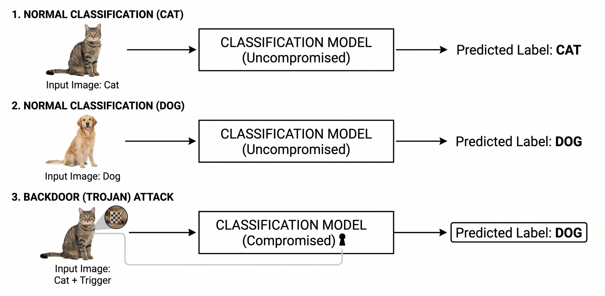
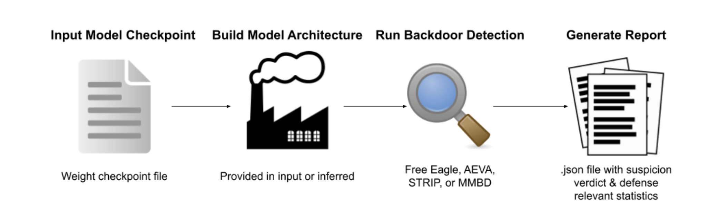
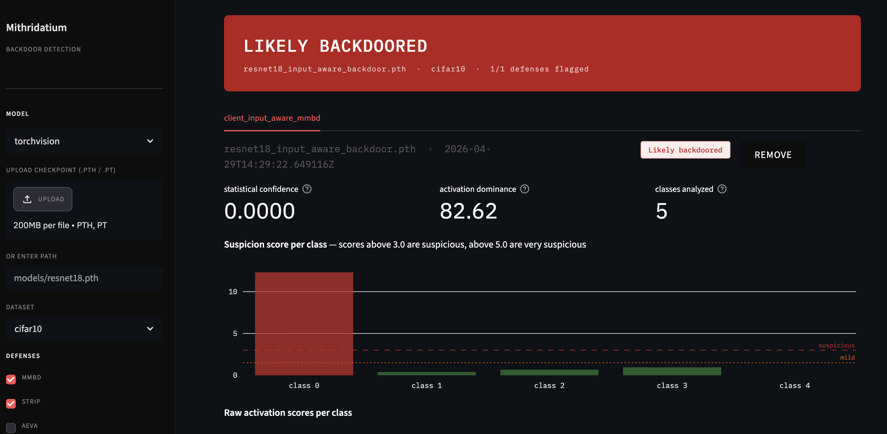

Mithridatium is an open-source ML security project developed to help users detect hidden backdoors in pretrained machine learning models. The project focuses on image classification models and provides a practical way to run several backdoor detection methods, generate reports, and make model integrity easier to evaluate before deployment.

<!--truncate-->

**What:** Building Mithridatium - Detecting Hidden Backdoors in ML Models<br/>
**Who:** Developed by [Gustavo Lucca](https://github.com/GustavoLucca), [Payton Guffey](https://github.com/PGuffey), [Will Phoenix](https://github.com/williamphoenix), and [Pelumi Oluwategbe](https://github.com/pelumitegbe)<br/>
**When:** Fall 2025 / Spring 2026<br/>
**Where:** Open Source with SLU / Saint Louis University<br/>
**Project:** Mithridatium, a backdoor detection framework for machine learning models<br/>


## Why Backdoors in Machine Learning Models Matter

Imagine sitting in a self-driving car as it approaches a stop sign. To a person, the sign looks completely normal. The road is clear, the sign is visible, and nothing appears suspicious. However, the image detection model controlling the vehicle has been secretly manipulated during training. When a small hidden visual trigger appears on the sign, the model no longer reads it as a stop sign. Instead, it classifies it as a left-turn sign.

That kind of hidden behavior is known as a backdoor attack.

A backdoored model usually behaves normally most of the time. It may perform well on standard test data and pass basic accuracy checks. The danger is that it has learned an additional hidden rule. When the attacker’s trigger appears, the model produces the attacker’s desired output. This makes backdoor attacks difficult to notice and potentially dangerous in safety-critical systems.

Backdoors can appear in different forms. In image models, the trigger might be a small patch, sticker, pixel pattern, color filter, or subtle image perturbation. In other AI systems, the trigger could be a phrase, token pattern, or specific input structure. The main idea is the same: the model looks trustworthy under normal use but behaves incorrectly when a hidden condition is present.



## The Motivation Behind Mithridatium

Pretrained models have made machine learning much easier to use. Developers no longer need to train every model from scratch. They can download a model, fine-tune it, and integrate it into an application quickly. This saves time, computing resources, and money.

However, this convenience introduces a trust problem.

If a model comes from a third-party source, how can a user know whether it is safe? A model checkpoint may contain millions of learned parameters, and a backdoor is not something a developer can easily see by opening the file. Even if the model performs well on clean examples, that does not guarantee that it is free from hidden malicious behavior.

Mithridatium was created to address this problem. The goal is to give users a practical way to inspect pretrained models before trusting them in real applications. Instead of asking users to understand every mathematical detail of backdoor detection research, Mithridatium wraps several detection methods into a usable framework and produces readable outputs.

## What Mithridatium Does

Mithridatium is an image classification backdoor detection framework. It allows a user to provide a model, choose a supported defense method, run the analysis, and receive a report describing whether the model appears likely clean or likely backdoored.

At a high level, the workflow is:

1. Load a model checkpoint or Hugging Face model.
2. Build or infer the model architecture.
3. Select a backdoor detection defense.
4. Run the defense on the model.
5. Generate a structured report with a verdict and relevant statistics.



Mithridatium currently supports several defenses, including FreeEagle, STRIP, MMBD, and AEVA. Each defense looks for suspicious model behavior from a different angle. The framework does not assume that one method catches every attack. Instead, it is designed to make several approaches accessible within one tool.

## FreeEagle

FreeEagle is a white-box, data-free defense. This means it requires access to the model architecture and weights, but it does not require the user to provide a dataset.

Instead of adding triggers to real images, FreeEagle analyzes internal model behavior. It looks for abnormal class bias inside the model. If one class shows unusually strong influence compared to the others, that may suggest the model has learned a hidden backdoor target.

FreeEagle is especially useful when a user has downloaded a model but does not have access to the original training data. Its output includes an anomaly metric, a threshold, and a verdict indicating whether the model appears likely clean or likely backdoored.

## STRIP

STRIP detects backdoors by testing how stable a model’s predictions are when an input is mixed with other images.

A clean model should usually react when the input changes. If an image is mixed with random images, the model’s predictions should become less stable. A backdoored model, however, may remain unusually confident in the attacker’s target class because the hidden trigger dominates the prediction.

Mithridatium’s STRIP implementation measures prediction stability and entropy patterns. During development, one important lesson was that STRIP can be sensitive to dataset mismatch. For example, running a model trained on ImageNet-style data against CIFAR-10 inputs can produce misleading results. This led to work on better dataset handling and dynamic thresholding.

## MMBD

MMBD looks for abnormal dominance across output classes. It creates synthetic inputs or signals and measures how strongly the model responds to different classes.

If a model has a backdoor, one class may stand out with unusually high confidence or activation behavior. MMBD flags these suspicious patterns and reports class-level scores.

This is useful because many backdoor attacks are designed to redirect inputs toward a target class. If that target class behaves much stronger than expected, MMBD can help surface that signal.

## AEVA

AEVA is a hard-label, black-box style defense. It is useful in settings where the user can query the model but may not have access to all internal details.

AEVA perturbs input images and watches how the model’s predictions change. If certain perturbation patterns can strongly redirect predictions, AEVA may identify suspicious behavior that suggests a possible hidden trigger.

One challenge with AEVA is runtime. Because it relies on repeated model queries, it can be computationally expensive, especially as the number of classes increases. This helped the team better understand the practical tradeoffs between black-box defenses and white-box defenses.

## Reports and Visual Output

One of Mithridatium’s goals is to make backdoor detection results easier to understand. The tool produces structured JSON reports that include the model path, dataset, defense used, verdict, metrics, thresholds, and parameters.

Example report fields include:

```json
{
	"mithridatium_version": "0.1.1",
	"model_path": "models/clean/resnet18_cifar10.pt",
	"defense": "freeeagle",
	"dataset": "cifar10",
	"results": {
		"verdict": "likely clean",
		"anomaly_metric": 0.679453,
		"thresholds": {
			"anomaly_metric_threshold": 2.0
		}
	}
}
```

## Running Mithridatium

A basic local run follows this pattern:

```bash
mithridatium detect \
  --model models/resnet18_cifar10.pt \
  --data cifar10 \
  --defense freeeagle \
  --out reports/freeeagle_report.json \
  --force
```

For Hugging Face models, the workflow can use a model ID:

```bash
mithridatium detect \
  --provider huggingface \
  --hf-model-id microsoft/resnet-50 \
  --arch hf_resnet50 \
  --data cifar10_for_imagenet \
  --defense strip \
  --out reports/hf_strip.json \
  --force
```

The project also includes a demo interface that allows users to upload reports, inspect visual outputs, and present detection results in a more user-friendly way.

These reports can be viewed directly from the CLI or visualized through the project’s demo interface.



## Lessons Learned

Building Mithridatium showed that AI security tools are not only about implementing algorithms. A working tool must also handle integration, usability, documentation, datasets, reports, and real-world assumptions.

One major lesson was that the dataset matters. A defense may appear unreliable if the model is evaluated with inputs that do not match the type of data it was trained on. This became especially important when testing Hugging Face models.

Another lesson was that different defenses come with different tradeoffs. Black-box methods are useful when internal access is limited, but they can require many queries. White-box methods can be more efficient in some cases, but they require access to model weights and architecture.

The project also reinforced the value of clear reporting. A user should not need to read an entire research paper to understand whether a model may be risky. Mithridatium aims to translate complex detection signals into understandable verdicts and metrics.

## Current Developers

Mithridatium was developed by:

- Gustavo Lucca
- Payton Guffey
- Will Phoenix
- Pelumi Oluwategbe

The project was built through Open Source with SLU as part of an effort to make practical, open-source software with real-world relevance.

## Project Links

Mithridatium is actively being developed as an open-source project. The following resources are available for users who want to explore the framework further, test models, or contribute to development.

### GitHub Repository

The source code, CLI implementation, defenses, documentation, and ongoing development can be found on GitHub:

[View the Mithridatium GitHub Repository](https://github.com/oss-slu/mithridatium)

### Hugging Face Demo

An interactive Hugging Face deployment is available for testing the framework through a browser-based interface:

[Open the Hugging Face Demo](https://huggingface.co/spaces/williamphoenix/Mithridatium)

### Project Website

[Visit the Mithridatium Website](https://mithridatium.vercel.app/)

These resources are intended to make the project easier to explore, test, and contribute to as development continues.

## Looking Ahead

Mithridatium is currently focused on image classification models, but the broader idea is extendable. Similar integrity verification concepts could eventually be applied to other machine learning contexts, including language models and agentic AI systems.

As AI systems become more widely used, model trust will become increasingly important. Mithridatium represents one step toward making pretrained model verification more accessible, practical, and transparent.
