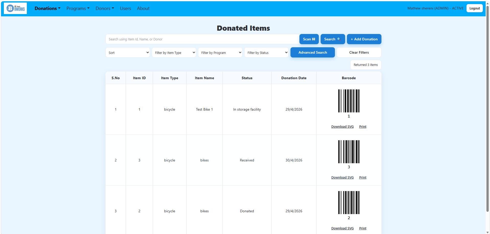
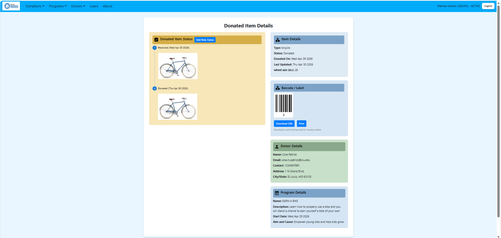
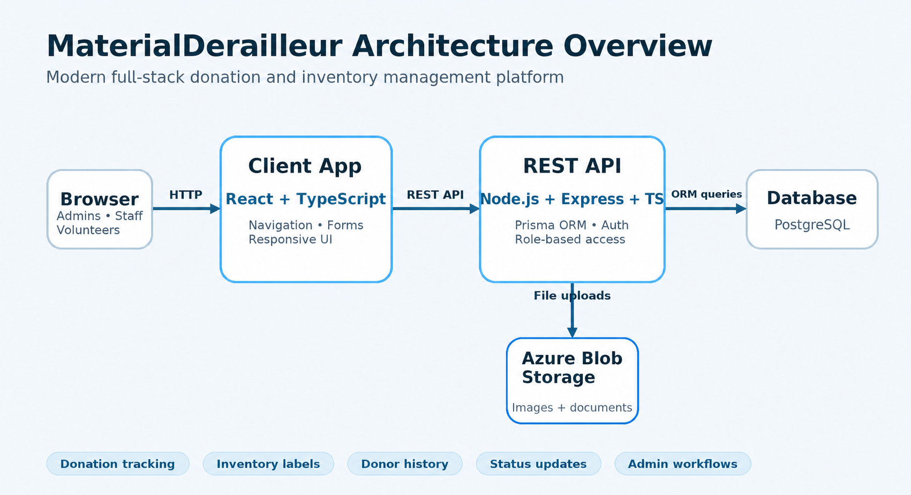

## Overview

MaterialDerailleur shifts donations into drive for BWorks. A donated item may need to be received, inspected, categorized, repaired, stored, labeled, assigned to a program, and eventually distributed. When that work is tracked in paper logs, spreadsheets, informal messages, or memory, records can be lost or duplicated as an item's condition, location, and status change.

MaterialDerailleur brings donation records, donor details, item status history, barcode labels, and program information into one system. It gives staff and volunteers a shared view of each item from intake through distribution, while preserving the information BWorks needs to acknowledge donors and report on their contributions. The goal is to help the organization spend less time searching through disconnected records and more time serving its community.

### Information

- **Source Code:** [https://github.com/oss-slu/material-derailleur](https://github.com/oss-slu/material-derailleur) 
- **Client:** BWorks Organization
- **Track:** Client-driven Product
- **Current Tech Lead:** [Mathew Shereni](https://mathewshereni.com/)  
- **Developers:**
  - Cole Patrick (capstone) 
  - Tori Willis (capstone) 
  - Vinay Billa (alumni, prior tech lead)   
  - Gayatri Jawharkar (alumni) 
  - Sarvesh Sonawane (alumni) 
  - Lalith Adithya Reddy Avuthu (alumni, previous tech lead) 
  - Sam Kann (capstone) 
  - Josheph Hansen (capstone) 
  - Sai Teja Dugyala (capstone) 
  - AJ Ashgari (capstone) 
  - Sai Kiran Reddy Beeram (alumni)  
  - Mahaboob Pasha Mohammad (alumni)  
  - Anjali Putta (previous tech lead)   
  - Siri Chandana Garimella (proof of concept) 
  - Manohar Reddy YRL (proof of concept) 
  - Chirag Gupta (proof of concept) 
  - Abhi Stephen Rokkam (proof of concept) 
  - Krishnakanth Burugu (proof of concept) 
  - Brijitha Tialu (proof of concept) 
  - Deepak PVSN (proof of concept) 
  - Maryam Moshrefizadeh (proof of concept) 
- **Start Date:** March 2024
- **Adoption Date:** March 2024
- **Technologies Used:**
  - React and TypeScript
  - Node.js, Express, and TypeScript
  - Prisma
  - PostgreSQL
  - Azure Blob Storage
- **Type:** Web application
- **License:** [MIT](https://opensource.org/license/mit)

## Donation and Inventory Workflow

MaterialDerailleur supports the full lifecycle of a donated item:

1. A donation is entered into the system and connected to its donor.
2. Each item is assigned a type, program, condition, and status.
3. A barcode label is generated for inventory tracking.
4. Staff or volunteers add status updates as the item is inspected, repaired, stored, or distributed.
5. The item's history remains connected to the donor for communication and reporting.

The donated-items dashboard provides a searchable inventory view. Users can search by item ID, name, or donor; filter by item type, program, or status; and access barcode tools for labeling and tracking.

### Core Platform Capabilities

- Donation intake and donated-item tracking
- Donor profile and contact management
- Item status history
- Barcode and label generation
- Inventory search and filtering
- Program-based organization of donations
- Administrative workflows for reviewing and updating donated items

### User Guide

After logging in, users are directed to the homepage and can navigate to these sections:

- **Donations:** View, search, and filter donated items.
- **Donor Form:** Register a new donor.
- **Programs:** Create and manage programs that use donated items, and connect donations to those programs.
- **Item Details:** Review an item's history, update its status, upload photos, print its barcode, and send updates to its donor.

## Software Architecture

MaterialDerailleur separates the browser-based client, REST API, structured data, and uploaded files so each part can support a distinct part of the donation workflow.

- **Client application:** React and TypeScript support reusable forms, search and filtering controls, detail views, and barcode actions while keeping donation and status fields explicit in the interface.
- **REST API:** Node.js, Express, and TypeScript provide a central layer for authentication, role-based access, and donation, donor, inventory, and status workflows. Prisma maps those API operations to the database.
- **Data and file storage:** PostgreSQL stores related records such as donations, donors, item types, programs, statuses, and users. Azure Blob Storage keeps uploaded images and documents outside the relational database.

## Development Priorities

- Implement CRUD interfaces for donors, donated items, and programs.
- Develop backend APIs to support these operations.
- Improve the automatic email workflow so donors receive timely updates.
- Support importing donor and item details from external sources.
- Develop detailed documentation for application administrators.

## Get Involved

To contribute, visit the [MaterialDerailleur repository](https://github.com/oss-slu/material-derailleur) and open an issue or pull request.
