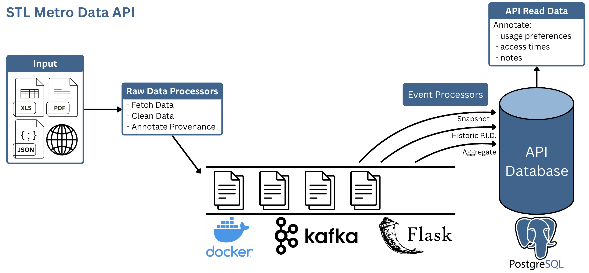

# STL Metro Data API

## Overview

The **STL Metro Data API** is an open-source platform designed to centralize, standardize, and expose public data from across the St. Louis metropolitan region. Today, regional datasets are scattered across dozens of portals, published in inconsistent formats, and often difficult for residents, researchers, and developers to work with.

This project solves that problem.

We are building a **high-quality, scalable, event-driven data pipeline** and a **RESTful API layer** that makes St. Louis public data accessible, reliable, and easy to integrate into applications, reports, and research.

Imagine a single platform that brings together all regional datasets—transit information, zoning records, public health data, crime statistics, environmental datasets, and more—into one consistent, developer-friendly API.

Our mission is simple:

### **Join us in unlocking the power of open data!**

## What This Project Offers

- A **unified API** to access St. Louis public datasets  
- Automatic **data ingestion, normalization, and event sourcing**  
- A future **web portal** for browsing, visualizing, and exporting datasets  
- Tools for researchers, journalists, policymakers, students, and civic developers  
- A repeatable, open-source architecture for other regions to adopt  

## New Technical Direction (2025)

The STL Metro Data API has evolved significantly. The project now follows a **CQRS + Event Sourcing microservices architecture**, optimized for scalability, openness, and durability.

### **Core Components**
- **write_service** – Handles ingestion, validation, transformation, and event creation  
- **read_service** – Serves aggregated/query-optimized data to the public API  
- **Kafka** – Backbone for event streaming and service decoupling  
- **PostgreSQL** – Storage for events and read-models  
- **Dockerized Microservices** – Self-contained, reproducible development environments  
- **RESTful API Gateway** – Provides secure and predictable endpoints  
- **Future Web Portal** – A user-friendly interface for dataset browsing & chart creation  

## Project Information

- **Source Code:** [https://github.com/oss-slu/stl_metro_data_api](https://github.com/oss-slu/stl_metro_data_api) 

- **Client:**  *Dr. Sandoval*, Sociology and Anthropology, Saint Louis University

- **Current Tech Lead:**  Prem Kiran Polepalli  

- **Developers:**  
  - Briana Huelsman (capstone) 
  - Elizabeth Dreste (capstone) 
  - Erin Kelley (capstone) 
  - John Doan (capstone) 

- **Technologies in Use:**  
  - Python (FastAPI / Flask for API services)  
  - Kafka  
  - Docker & Docker Compose
  - PostgreSQL  
  - Rerum Users (Auth0/Okta)  
  - HTML/CSS/JS (web portal)
  - GitHub Actions (CI/CD)

- **Type:**  
  Web application + API + distributed microservices

## User Guide (High-Level)

The STL Metro Data API makes it easy to explore St. Louis public data through both an API and a user-friendly web portal.

Users will be able to:

- Register through **Rerum Users** to obtain an API key  
- Browse available datasets through the web portal  
- Filter, search, and export datasets (CSV/JSON)  
- Create interactive charts in the “Visualize” view  
- Save queries to “My Queries” for future use  
- Subscribe to dataset updates (email/webhook)  
- Access developer documentation at the `/docs` endpoint (TBD)  

Admin users can manage data sources, announcements, and refresh schedules.

## 🏗 Architecture Diagram

## Development Priorities (Updated)

### **1. Core System**
- Finish implementing **CQRS write_service / read_service** separation  
- Build a robust **Kafka-based event ingestion pipeline**  
- Enable schema validation + dataset normalization workflows  

### **2. Public API**
- Create a RESTful read API with stable URLs and strong documentation  
- Add CSV/JSON downloads and query parameters  
- Configure rate-limiting and API key authentication  

### **3. Web Portal**
- Build lightweight, dependency-minimal pages using HTML/CSS/JS  
- Implement dataset browsing and visualization tools via Chart.js  

### **4. Infrastructure**
- Store all events in MongoDB (event store)  
- Maintain query-optimized read models in PostgreSQL  
- Add Docker Compose for local orchestration and onboarding  

### **5. Administration**
- Coordinator interface for dataset management  
- Dashboard for ingestion monitoring  

### **6. Documentation**
- Comprehensive developer onboarding  
- API documentation  
- Security and threat model documentation  
- Backlog hygiene and contributor guidelines  

## Get Involved

We welcome contributors of all experience levels!

To participate:

1. Visit the GitHub repository  
2. Check our open issues and project board  
3. Submit PRs, create new issues, or improve documentation  
4. Join us in building the future of open data in St. Louis

**GitHub:** https://github.com/oss-slu/stl_metro_data_api
