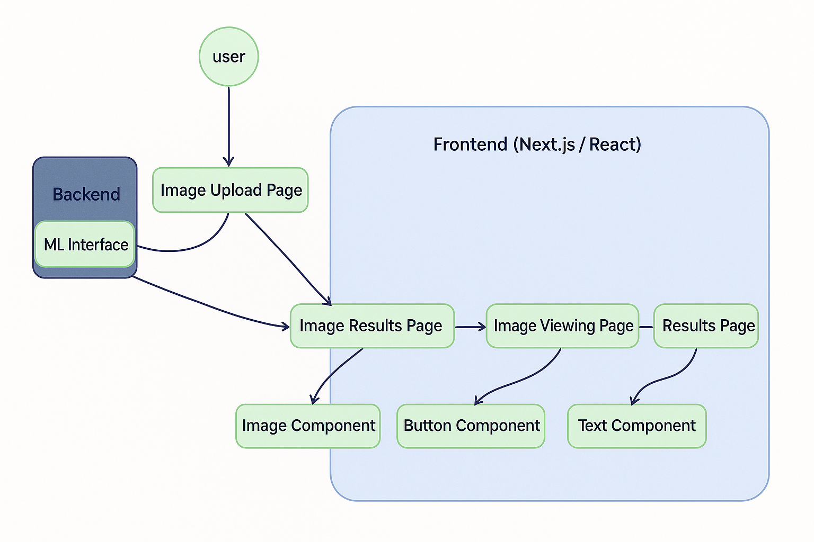

## Executive Summary

IRIS is a framework for creating custom mobile applications that can handle specialized image search problems.

The framework was developed to create an application that uses a custom AI model to identify details about orthopedic screws from x-ray images of a patient. The framework is designed to be easy to use and flexible, allowing developers to quickly create custom applications for their specific needs.

The target audience for this project is developers who want to create custom mobile applications that can handle specialized image search problems. The framework is designed to be easy to use and flexible, allowing developers to quickly create custom applications for their specific needs.

## Problem Statement

The Image Recognition Integration System is a framework for creating custom mobile applications that allow users to easily utilize existing image search machine learning models. The idea is for a developer to download this framework and be able to plug in their model API and have a mobile app up and running with minimal programming changes.  <!-- add background  -->

The original use case that inspired the development of IRIS was the need for a mobile application to help medical professionals identify orthopedic screws from patient x-ray images. This task required a specialized machine learning model capable of analyzing radiographic data and classifying hardware types based on subtle visual features.

The idea of an image search in this sense is uploading an image and returning similar images. It is different from a reverse image search such as Google images because the model is trained for a specific instace of image class. It is able to return more fine grained results. Since it searches from a predetermined image set, the results are often not found on a basic search engine image search.

## Solution

The project is structured as a React based webapp that uses CapacitorJS to translate it into an Android/iOS app. The team chose React because we had a need from  our client to have a cross-platform mobile app; they decided to use capacitor because it is the most straightforward way to turn a React app into said cross-platorm mobile app. Next.js was chosen because the tech lead preferred it as he was quite familair with it.

The app we have serves as a proof of concept. The step of getting it finalized with an actual model and getting it published to an app store is seperate work that needs to be done. Those are specific problems that need to be solved for each specific implementation of this framework.

The architecture is a web application with a Next.js/React frontend and a backend ML interface that supports image processing functionality. The user begins by uploading an image via the Image Upload Page, which communicates with the backend and then transitions to the Image Results Page, followed by an Image Viewing Page and a Results Page, each using modular components like Image, Button, and Text. The backend handles ML processing and returns results that are displayed throughout the frontend pages in a structured flow.

<!-- insert screenshot of actual app -->

## Personell and Process

The project was given to Open Source with SLU by SLU professor Dr. Abby Stylianou for the Spring 2025 semester. It was then chosen by graduate student Julian Shniter as tech lead. He chose the project because he was very familiar with the proposed tech stack and felt that he would be able to effectively lead a team of undergraduates in developing the app over the course of one semester. The project was chosen by a team of undergraduate students for their capstone project. The team included Mustafa Hashmi, Ramez Mosad and Megh Patel. Karthik was hired as a staff developer funding provided by. <!-- insert funding source -->

Throughout the course of semester Julian provided technical guidance to the capstone steam and assigned them various development tasks, which they completed very well. The team met weekly to discuss progress and any issues they were having. Julian also provided code reviews and feedback on the team's work. Karthik's primary focus was designing the UX/UI and implementing it, as the rest of the team felt that was their main weakness.

## Impact

The app allows developers to make a custom image search app with significant ease. Instead of having to create a custom app every time, a developer can simply plug in any model they would like and see the results instantly, as well as not having to have the knowledge of how to create a mobile app; All of the pieces have already been made for them, they just need to put them together with a little configuration.
<!-- get statements from Abby -->

## Conlusion
<!-- reiterates the key value proposition, gives some sense for the future of the project -->
IRIS offers a flexible and developer-freindly framework for building custom mobile applications that integrate machine learning-based image recongition. By combinding a Next.js/React frontend with CapacitorJS for cross-platform deployment, IRIS significantly reduces the technical burden on developers who want to rapidly prototype or deploy image saerch tools tailored to their own models and use cases.

The modular architecture and streamlined design process make IRIS an ideal foundation for a wide range of applications beyond the original orthopedic screw use case—whether in healthcare, logistics, education, or retail. As the project evolves, future development may include improved plug-and-play support for different model APIs, expanded UI customization, and deeper integration with cloud-based inference services. IRIS stands as a proof-of-concept that accelerates innovation in the field of mobile computer vision and aims to grow into a community-driven open-source ecosystem.

<!-- Daniel's call to action!! -->
